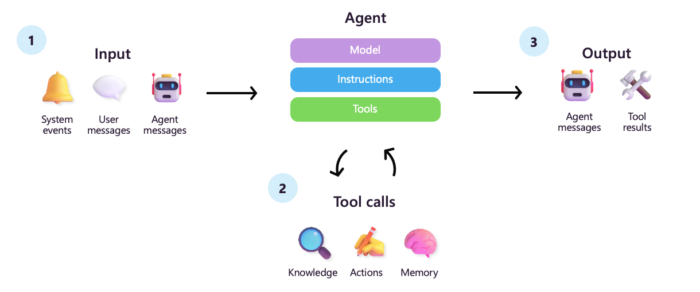
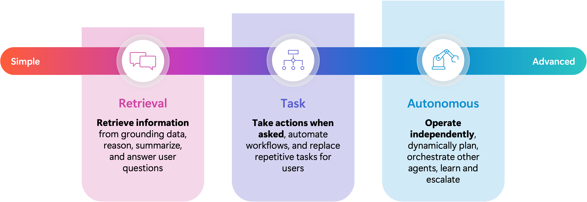

# Microsoft Agent Framework - learn how to adress agentic enterprise scenarios

Join us for an immersive hands-on lab focused on Microsoft Agent Framework, where you will learn how to build intelligent multi-agent systems that leverage Azure AI capabilities. This session is designed for architects, developers, and AI enthusiasts who want to explore practical implementations of orchestration patterns.

## Table of Contents

1. [Overview](#overview)
2. [Prerequisites](#prerequisites)
3. [Environment Setup](#environment-setup)
4. [Repository Guide](#repository-guide)
5. [Learning Path](#learning-path)
6. [Troubleshooting](#troubleshooting)
7. [Additional Resources](#additional-resources)

## What is an Agent?

> ***agent***: 	perceives its environment, makes decisions, takes actions autonomously in order to achieve goals, and may improve its performance with learning or acquiring knowledge 



A simple LLM-based chatbot primarily focuses on generating responses based on predefined patterns and language models, often requiring user input to continue the conversation. In contrast, autonomous agents are designed to perform tasks independently, making decisions and taking actions without constant user input, often leveraging advanced AI techniques to achieve their goals. 



## Prerequisites

- Python 3.10 or later
- An GitHub account with a developer access token
- Optional: Redis, AI Search and Application Insights

## Environment Setup

1. **Install packages**  
   ```bash
   pip install -r requirements.txt
   ```

2. **Configure environment variables**  
    This project does not require azure resources and support GitHub AI models.

    1. Create a personal access token

    To authenticate with the model you will need to generate a personal access token (PAT) in your GitHub settings or set up an Azure production key. [GitHub Free AI Token](https://github.com/settings/tokens)

    You can now access AI inference with your GitHub PAT. [Learn more about limits based on your plan](https://github.com/marketplace/models/azure-openai/gpt-4o-mini/playground#:~:text=Learn%20more%20about%20limits%20based%20on%20your%20plan.). You do not need to give any permissions to the token. 

    To use the code snippets below, create an environment variable to set your token as the key for the client code.

    If you're using bash:
    ```
    export GITHUB_TOKEN="<your-github-token-goes-here>"
    ```

    or rename the file `.env.template` to `.env` and put the value inside the `.env` file. Each python script will load the value from that value automatically.

## Repository Guide
This repository contains sample agents, workflows, and MCP servers you can run locally.

### Samples

- `samples/simple-agents/basic-agent.py` – minimal single agent using GitHub models.
- `samples/simple-agents/agents-using-mcp.py` – agent calling tools exposed via MCP.
- `samples/simple-agents/human-in-the-loop.py` – demonstrates human approval / intervention patterns.
- `samples/workflows/generation-workflow.py` – simple generation-first workflow orchestration sample.
- `samples/workflows/parallel-agents.py` – runs multiple agents in parallel and aggregates results.

### MCP servers
This repo includes several example MCP-compatible servers you can run locally:

- **Customer MCP server** (`src/mcp-server/01-customer-server/`)
    - Run SSE server:
        ```bash
        cd src/mcp-server/01-customer-server
        python server-mcp-sse-customers.py
        ```
    - Run sample client/runner:
        ```bash
        cd src/mcp-server/01-customer-server
        python run-mcp-customers.py
        ```

- **User MCP server** (`src/mcp-server/02-user-server/`)
    - Run SSE server:
        ```bash
        cd src/mcp-server/02-user-server
        python server-mcp-sse-user.py
        ```
    - Run sample client/runner:
        ```bash
        cd src/mcp-server/02-user-server
        python run-mcp-user.py
        ```

- **Banking MCP server** (`src/mcp-server/03-banking-server/`)
    - Run SSE server:
        ```bash
        cd src/mcp-server/03-banking-server
        python server-mcp-sse-banking.py
        ```
    - Run sample client/runner:
        ```bash
        cd src/mcp-server/03-banking-server
        python run-mcp-banking.py
        ```

### Scenarios


## Troubleshooting

- **Missing environment variables** — Verify `.env` mirrors the keys called out in notebook setup cells.
- **Package import errors** — Ensure the `agent-framework` packages were installed into the same interpreter that launches Jupyter.
- **Redis connectivity** — Update the connection string in the Redis samples and confirm the service is reachable before running the notebook cells.
- **Application Insights ingestion delay** — Telemetry can take a few minutes to appear in the Azure portal; use the Live Metrics Stream for near-real-time debugging.

## Additional Resources

- Product documentation: <https://learn.microsoft.com/en-us/agent-framework/overview/agent-framework-overview>
- GitHub repository: <https://github.com/microsoft/agent-framework>
- Microsoft AI guidance: <https://learn.microsoft.com/azure/ai-services/>
