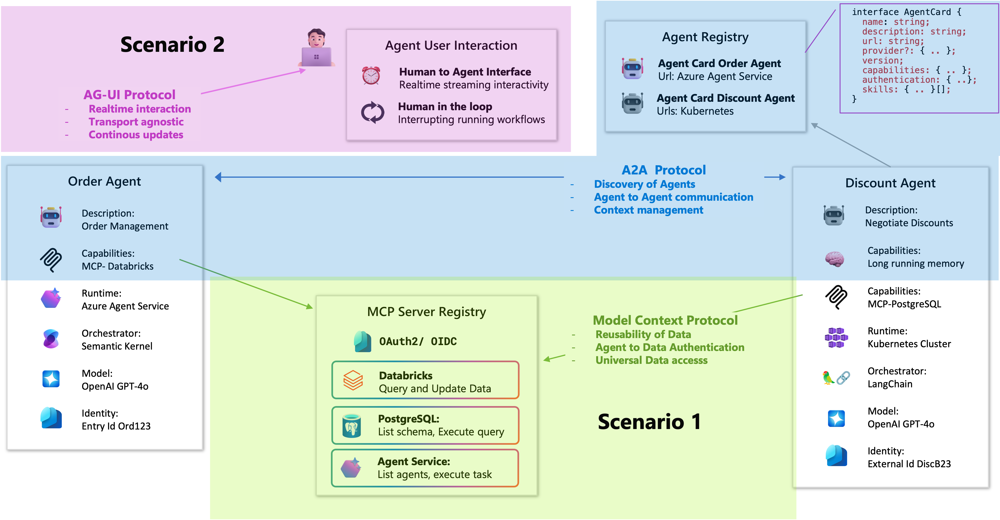
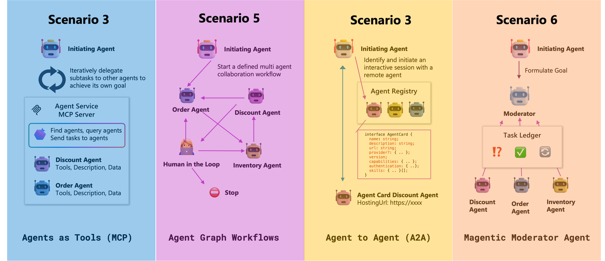

# Microsoft Agent Framework - learn how to adress agentic enterprise scenarios

Join us for an immersive hands-on lab focused on Microsoft Agent Framework, where you will learn how to build intelligent multi-agent systems that leverage Azure AI capabilities. This session is designed for architects, developers, and AI enthusiasts who want to explore practical implementations of orchestration patterns.

## Table of Contents

1. [Overview](#overview)
2. [Prerequisites](#prerequisites)
3. [Learning Goals](#learning-goals-for-this-workshop)
3. [Environment Setup](#environment-setup)
4. [Workshop Scenarios](#workshop-scenarios)
5. [Troubleshooting](#troubleshooting)
6. [Additional Resources](#additional-resources)

## What is an Agent?

> ***agent***: 	perceives its environment, makes decisions, takes actions autonomously in order to achieve goals, and may improve its performance with learning or acquiring knowledge 


## Learning Goals for this workshop

This workshop is about learning to work with the Microsoft Agent Framwork - independently of AI Foundry.


### 🛠 Agent Authoring
Learning to use the *Microsoft Agent Framework* SDK for code-based and declarative agent development.


### 🚀 Agent Debugging
Build, Test and Deploy agents using the DevUI, Foundry UI or VSCode Extension.


### 🔌 Connecting Agents
Connect agents using AG-UI, MCP, A2A Protocols to integrate them into your solutions.



### ⚙️ Multi-Agent Orchestration
Define multi-agent orchestration workflows to solve complex problems with agents.



### 🔍 Agent Tracing & Evaluation
Trace agent behaviour,  execution flows and evaluate quality and safety of agents.


## Prerequisites

- Python 3.10 or later
- An GitHub account with a developer access token
- Optional: Redis, AI Search and Application Insights

## Environment Setup

1. **Install packages**  (will be automatically done when using Codespaces)
   ```bash
   pip install -r requirements.txt
   ```

2a. **Configure environment variables (for GitHub Models)**  
   This project supports GitHub AI models via a personal access token (PAT).

   1. Create a personal access token

   To authenticate with the model you will need to generate a personal access token (PAT) in your GitHub settings. [GitHub Free AI Token](https://github.com/settings/tokens)

   You can now access AI inference with your GitHub PAT. [Learn more about limits based on your plan](https://github.com/marketplace/models/azure-openai/gpt-4o-mini/playground#:~:text=Learn%20more%20about%20limits%20based%20on%20your%20plan.). You do not need to give any permissions to the token besides Model usage.

   2. Configure the `.env` file

   Rename the file `.env.example` to `.env` and set the `GITHUB_TOKEN` value:

   ```bash
   GITHUB_TOKEN="<your-github-pat>"
   ```

   Each Python script will load the values from the `.env` file automatically.

2b. **Configure environment variables (for Azure OpenAI Models)**

   If you want to use Azure OpenAI instead of (or in addition to) GitHub Models, also set the Azure-specific values in your `.env` file:

   ```bash
   AZURE_OPENAI_API_KEY="<your-azure-openai-key>"
   AZURE_OPENAI_ENDPOINT="https://<your-resource-name>.openai.azure.com/openai/v1/"
   AZURE_OPENAI_VERSION="2024-10-01-preview"
   COMPLETION_DEPLOYMENT_NAME="<your-completions-deployment-name>"
   SMALL_DEPLOYMENT_MODEL_NAME="<your-small-model-deployment-name>"
   RESPONSES_DEPLOYMENT_NAME="<your-responses-deployment-name>"
   ```

   The default values and structure for these settings are documented in the `.env.example` file.

 
## Workshop Scenarios

This workshop is organized into seven independent, progressively more advanced scenarios. Each scenario has its own `README.md` in `src/scenarios` describing goals, tasks, references, and example prompts.

You do not have to use **[Spec Kit](https://speckit.org/)** for this workshop but we recommend to take a look because it a great way to practice professional software engineering with AI assistance.

1. **Scenario 1 – learning how to build your first agent**  
   Learn how to define a basic agent, connect tools, and use the Agent Framework Dev UI to inspect activities, metrics, and traces while the agent answers time and weather questions and maintains conversational memory.  
   See [Scenario 1 README](src/scenarios/01-hello-world-agent/README.md).

2. **Scenario 2 – building a user interface for your agent**  
   Build a console-based client that talks to your agent over the AG-UI protocol, so you can send user input and receive agent responses without building a full web UI.  
   See [Scenario 2 README](src/scenarios/02-building-agent-ui/README.md).

3. **Scenario 3 – exposing your agents to other agents**  
   Expose a weather agent over the A2A protocol and connect it to a separate travel-planning agent that calls it remotely to plan 5-day trips only to locations with good weather.  
   See [Scenario 3 README](src/scenarios/03-connecting-two-agents/README.md).

4. **Scenario 4 – orchestrating a workflow across multiple agents**  
   Use deterministic workflows to control the order in which several agents (preference collection, location suggestion, weather checking, summarization) collaborate to create a travel plan.  
   See [Scenario 4 README](src/scenarios/04-orchestrating-agents/README.md).

5. **Scenario 5 – declarative agents and workflows**  
   Recreate the travel planning and weather validation flow using declarative agent and workflow definitions instead of imperative code, to understand low-code orchestration patterns.  
   See [Scenario 5 README](src/scenarios/05-declarative-agents/README.md).

6. **Scenario 6 – moderating a discussion between agents**  
   Design a multi-agent travel system (places, weather, activities, flights, hotels) coordinated by a moderator/orchestrator such as Magentic One, enforcing global rules like budget, preferred locations, and activity diversity.  
   See [Scenario 6 README](src/scenarios/06-moderating-agents/README.md).

7. **Scenario 7 – agent observability and evaluation**  
   Enable OpenTelemetry-based tracing and metrics for one of your agents, wire it to an observability backend if available, and use evaluation loops and custom metrics to analyze and improve behavior.  
   See [Scenario 7 README](src/scenarios/07-observability/README.md).

## Troubleshooting

- **Missing environment variables** — Verify `.env` mirrors the keys called out.
- **Model deployments** - Make sure the model deployment names are matched in the env file. Notice that GitHub model deployment names are starting with a provider prefix "openai/gpt-5-nano" instead of "gpt-5-nano".
- **Application Insights ingestion delay** — Telemetry can take a few minutes to appear in the Azure portal; use the Live Metrics Stream for near-real-time debugging.

## Additional Resources

- Product documentation: <https://learn.microsoft.com/en-us/agent-framework/overview/agent-framework-overview>
- GitHub repository: <https://github.com/microsoft/agent-framework>
- Microsoft AI guidance: <https://learn.microsoft.com/azure/ai-services/>
